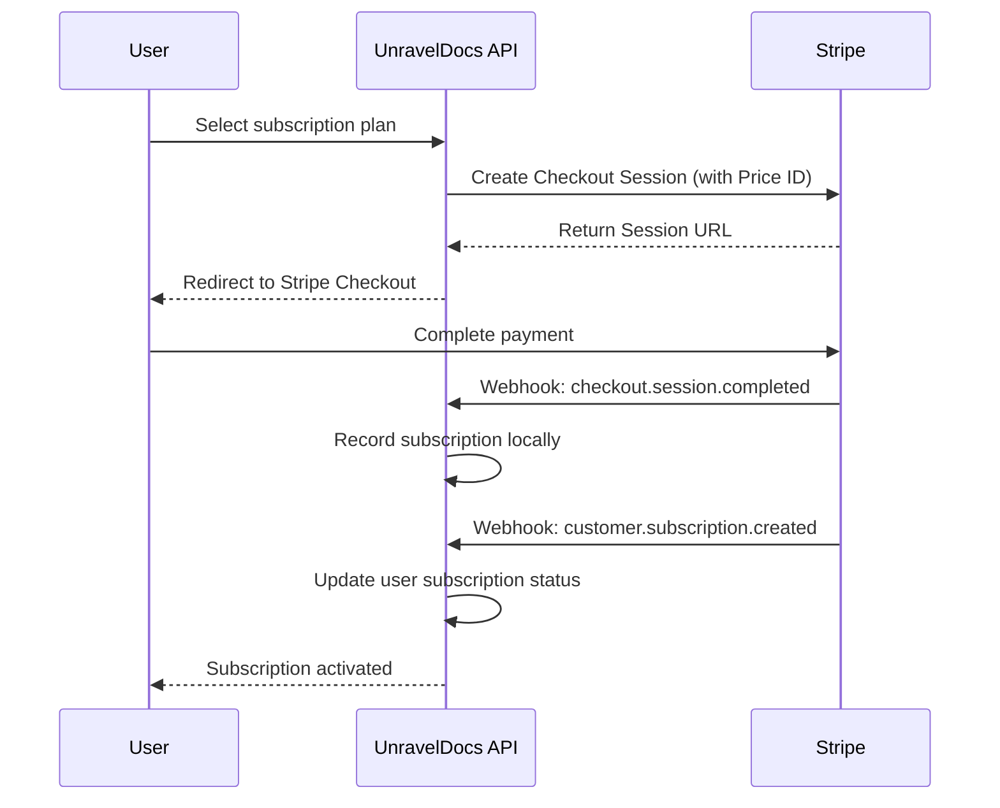
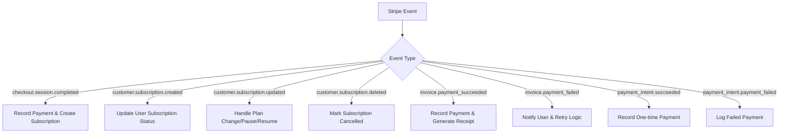

# Stripe Payment Gateway Setup Guide

This guide explains how to set up and configure Stripe to align with UnravelDocs payment plans for both **Individual** and **Team** subscriptions.

---

## Table of Contents

1. [Payment Flow Overview](#payment-flow-overview)
2. [Stripe Dashboard Setup](#stripe-dashboard-setup)
3. [Individual Subscription Plans](#individual-subscription-plans)
4. [Team Subscription Plans](#team-subscription-plans)
5. [Creating Products & Prices in Stripe](#creating-products--prices-in-stripe)
6. [Webhook Configuration](#webhook-configuration)
7. [Application Configuration](#application-configuration)
8. [Testing with Stripe Test Mode](#testing-with-stripe-test-mode)

---

## Payment Flow Overview



### Key Components

| Component | Description |
|-----------|-------------|
| **Checkout Session** | Stripe-hosted payment page for secure transactions |
| **Price ID** | Unique identifier for each pricing tier (stored in DB) |
| **Webhooks** | Real-time notifications from Stripe for payment events |
| **Customer** | Stripe customer object linked to UnravelDocs user |

---

## Stripe Dashboard Setup

### Step 1: Create a Stripe Account

1. Go to [Stripe Dashboard](https://dashboard.stripe.com)
2. Sign up or log in to your account
3. Complete business verification (for live mode)

### Step 2: Get API Keys

Navigate to **Developers → API Keys**:

| Key Type | Usage |
|----------|-------|
| **Publishable Key** | Frontend (starts with `pk_test_` or `pk_live_`) |
| **Secret Key** | Backend API calls (starts with `sk_test_` or `sk_live_`) |

> [!CAUTION]
> Never expose your Secret Key in client-side code or public repositories.

### Step 3: Enable Test Mode

Toggle **Test Mode** in the Stripe Dashboard for development. All test transactions use test card numbers like `4242 4242 4242 4242`.

---

## Individual Subscription Plans

UnravelDocs offers the following individual subscription tiers:

| Plan | Billing Cycle | Database Enum |
|------|---------------|---------------|
| **Free** | N/A | `FREE` |
| **Starter** | Monthly | `STARTER_MONTHLY` |
| **Starter** | Yearly | `STARTER_YEARLY` |
| **Pro** | Monthly | `PRO_MONTHLY` |
| **Pro** | Yearly | `PRO_YEARLY` |
| **Business** | Monthly | `BUSINESS_MONTHLY` |
| **Business** | Yearly | `BUSINESS_YEARLY` |

### Database Schema (Individual)

The `subscription_plans` table stores:

| Column | Description |
|--------|-------------|
| `name` | Enum value (e.g., `STARTER_MONTHLY`) |
| `price` | Plan price in decimal |
| `currency` | Currency code (e.g., `USD`) |
| `billing_interval_unit` | `MONTH` or `YEAR` |
| `billing_interval_value` | Number of intervals (1 for monthly, 12 for yearly) |
| `stripe_price_id` | **Stripe Price ID** (e.g., `price_1ABC123...`) |
| `paystack_plan_code` | Paystack plan code (if using Paystack) |
| `paypal_plan_code` | PayPal plan code (if using PayPal) |

---

## Team Subscription Plans

Team subscriptions have two tiers with separate monthly and yearly pricing:

| Plan | Billing Cycle | Database Name |
|------|---------------|---------------|
| **Team Premium** | Monthly | `TEAM_PREMIUM` |
| **Team Premium** | Yearly | `TEAM_PREMIUM` |
| **Team Enterprise** | Monthly | `TEAM_ENTERPRISE` |
| **Team Enterprise** | Yearly | `TEAM_ENTERPRISE` |

### Database Schema (Team)

The `team_subscription_plans` table stores:

| Column | Description |
|--------|-------------|
| `name` | Plan identifier (`TEAM_PREMIUM`, `TEAM_ENTERPRISE`) |
| `monthly_price` | Monthly price |
| `yearly_price` | Yearly price |
| `stripe_price_id_monthly` | Stripe Price ID for monthly billing |
| `stripe_price_id_yearly` | Stripe Price ID for yearly billing |
| `paystack_plan_code_monthly` | Paystack code for monthly |
| `paystack_plan_code_yearly` | Paystack code for yearly |

---

## Creating Products & Prices in Stripe

### Step 1: Create Products

In **Stripe Dashboard → Products**, create a Product for each tier:

#### Individual Products

| Product Name | Description |
|--------------|-------------|
| UnravelDocs Starter | Entry-level document extraction |
| UnravelDocs Pro | Advanced features for professionals |
| UnravelDocs Business | Full-featured business solution |

#### Team Products

| Product Name | Description |
|--------------|-------------|
| UnravelDocs Team Premium | Collaborative team features |
| UnravelDocs Team Enterprise | Enterprise-grade team solution |

### Step 2: Add Prices to Each Product

For each product, add **recurring prices**:

#### Individual Plan Prices

```
Product: UnravelDocs Starter
├── Price: $9.99/month  → stripe_price_id for STARTER_MONTHLY
└── Price: $99.99/year → stripe_price_id for STARTER_YEARLY

Product: UnravelDocs Pro
├── Price: $19.99/month → stripe_price_id for PRO_MONTHLY
└── Price: $199.99/year → stripe_price_id for PRO_YEARLY

Product: UnravelDocs Business
├── Price: $49.99/month → stripe_price_id for BUSINESS_MONTHLY
└── Price: $499.99/year → stripe_price_id for BUSINESS_YEARLY
```

#### Team Plan Prices

```
Product: UnravelDocs Team Premium
├── Price: $29.99/month → stripe_price_id_monthly for TEAM_PREMIUM
└── Price: $299.99/year → stripe_price_id_yearly for TEAM_PREMIUM

Product: UnravelDocs Team Enterprise
├── Price: $99.99/month → stripe_price_id_monthly for TEAM_ENTERPRISE
└── Price: $999.99/year → stripe_price_id_yearly for TEAM_ENTERPRISE
```

### Step 3: Copy Price IDs

After creating each price, copy the **Price ID** (starts with `price_`):

1. Click on the product
2. Find the price under "Pricing"
3. Click the price to view details
4. Copy the **Price ID**

### Step 4: Update Database

Insert or update the Price IDs in your database:

```sql
-- Individual Plans
UPDATE subscription_plans 
SET stripe_price_id = 'price_XXXX' 
WHERE name = 'STARTER_MONTHLY';

UPDATE subscription_plans 
SET stripe_price_id = 'price_YYYY' 
WHERE name = 'STARTER_YEARLY';

-- Repeat for PRO and BUSINESS plans...

-- Team Plans
UPDATE team_subscription_plans 
SET stripe_price_id_monthly = 'price_AAAA',
    stripe_price_id_yearly = 'price_BBBB'
WHERE name = 'TEAM_PREMIUM';

UPDATE team_subscription_plans 
SET stripe_price_id_monthly = 'price_CCCC',
    stripe_price_id_yearly = 'price_DDDD'
WHERE name = 'TEAM_ENTERPRISE';
```

---

## Webhook Configuration

### Step 1: Create Webhook Endpoint

In **Stripe Dashboard → Developers → Webhooks**:

1. Click **Add endpoint**
2. Enter your endpoint URL:
   - **Test**: `https://your-dev-domain.com/api/v1/stripe/webhooks`
   - **Live**: `https://your-production-domain.com/api/v1/stripe/webhooks`

### Step 2: Select Events

Subscribe to these events:

| Event | Purpose |
|-------|---------|
| `checkout.session.completed` | User completed checkout |
| `customer.subscription.created` | New subscription created |
| `customer.subscription.updated` | Subscription modified (upgrade/downgrade) |
| `customer.subscription.deleted` | Subscription cancelled |
| `invoice.payment_succeeded` | Recurring payment successful |
| `invoice.payment_failed` | Payment failed (dunning) |
| `payment_intent.succeeded` | One-time payment successful |
| `payment_intent.payment_failed` | One-time payment failed |

### Step 3: Copy Webhook Secret

After creating the webhook, copy the **Signing Secret** (starts with `whsec_`).

> [!IMPORTANT]
> The webhook secret is used to verify that events are genuinely from Stripe.

### Webhook Flow Diagram



---

## Application Configuration

### Environment Variables

Add these to your `.env` or `application.properties`:

```properties
# Stripe Configuration
stripe.api-key=${STRIPE_API_KEY}
stripe.webhook-secret=${STRIPE_WEBHOOK_SECRET}
stripe.currency=usd
stripe.checkout.success-url=https://yourdomain.com/payment/success?session_id={CHECKOUT_SESSION_ID}
stripe.checkout.cancel-url=https://yourdomain.com/payment/cancel
```

### Spring Boot Properties

```properties
# application.properties
stripe.api-key=sk_test_XXXXXXXXXXXX
stripe.webhook-secret=whsec_XXXXXXXXXXXX
stripe.currency=usd
stripe.checkout.success-url=http://localhost:3000/payment/success
stripe.checkout.cancel-url=http://localhost:3000/payment/cancel
```

---

## Testing with Stripe Test Mode

### Test Card Numbers

| Card Number | Scenario |
|-------------|----------|
| `4242 4242 4242 4242` | Successful payment |
| `4000 0000 0000 0002` | Card declined |
| `4000 0000 0000 9995` | Insufficient funds |
| `4000 0025 0000 3155` | Requires 3D Secure authentication |

### Test Webhook Events

Use Stripe CLI to test webhooks locally:

```bash
# Install Stripe CLI
# Windows (with scoop)
scoop install stripe

# Login to Stripe
stripe login

# Forward webhooks to local server
stripe listen --forward-to localhost:8080/api/v1/stripe/webhooks

# Trigger test events
stripe trigger checkout.session.completed
stripe trigger customer.subscription.created
stripe trigger invoice.payment_succeeded
```

### API Testing Flow

1. **Create Checkout Session**:
   ```bash
   POST /api/v1/stripe/checkout/session
   {
     "priceId": "price_XXXX",
     "mode": "subscription",
     "successUrl": "http://localhost:3000/success",
     "cancelUrl": "http://localhost:3000/cancel"
   }
   ```

2. **Complete payment on Stripe Checkout page**

3. **Verify subscription created via webhook**

4. **Check user subscription status**:
   ```bash
   GET /api/v1/subscriptions/current
   ```

---

## Summary Checklist

- [ ] Create Stripe account and complete verification
- [ ] Get API keys (test and live)
- [ ] Create Products for each subscription tier
- [ ] Add Monthly and Yearly Prices to each Product
- [ ] Copy Price IDs and update database
- [ ] Configure webhook endpoint in Stripe Dashboard
- [ ] Subscribe to required events
- [ ] Copy webhook signing secret
- [ ] Update application configuration
- [ ] Test with Stripe CLI and test cards
- [ ] Verify webhook handling is working
- [ ] Switch to Live mode for production

---

## Related Documentation

- [API Documentation](./API_DOCUMENTATION.md)
- [AWS Deployment Guide](./AWS_DEPLOYMENT_GUIDE.md)
- [Stripe Official Docs](https://stripe.com/docs)
