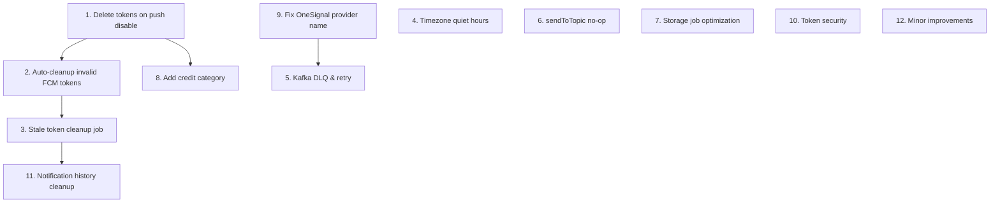

# 🔔 Push Notification System — Improvements & Hardening

> **Priority:** High  
> **Component:** `pushnotification` package  
> **Labels:** `enhancement`, `performance`, `reliability`, `tech-debt`

---

## Summary

After an in-depth analysis of the push notification subsystem, several critical improvements have been identified across device token lifecycle management, Kafka resilience, notification delivery reliability, and data hygiene. The most significant gap is that **disabling push notifications does not delete or clean up device tokens**, leading to stale data accumulation and unnecessary storage.

---

## 1. 🗑️ Delete Device Tokens When User Disables Push Notifications

**Priority:** 🔴 Critical  
**Files:**
- [NotificationPreferencesServiceImpl.java](file:///c:/Users/afiaa/Desktop/projects/Brints/unraveldocs-api/src/main/java/com/extractor/unraveldocs/pushnotification/impl/NotificationPreferencesServiceImpl.java)
- [DeviceTokenRepository.java](file:///c:/Users/afiaa/Desktop/projects/Brints/unraveldocs-api/src/main/java/com/extractor/unraveldocs/pushnotification/repository/DeviceTokenRepository.java)

**Problem:**  
When a user sets `pushEnabled = false` via `PUT /api/v1/notifications/preferences`, the [updatePreferences()](file:///c:/Users/afiaa/Desktop/projects/Brints/unraveldocs-api/src/main/java/com/extractor/unraveldocs/pushnotification/impl/NotificationPreferencesServiceImpl.java#36-65) method only updates the boolean flag. The user's device tokens remain in the `user_device_tokens` table, consuming storage and serving no purpose.

**Current behavior:**
```java
// NotificationPreferencesServiceImpl.java:38-63
public NotificationPreferencesResponse updatePreferences(String userId, UpdatePreferencesRequest request) {
    NotificationPreferences preferences = getOrCreatePreferences(userId);
    preferences.setPushEnabled(request.getPushEnabled());
    // ... updates other fields
    // ❌ No device token cleanup when pushEnabled transitions to false
}
```

**Required changes:**
- Inject [DeviceTokenService](file:///c:/Users/afiaa/Desktop/projects/Brints/unraveldocs-api/src/main/java/com/extractor/unraveldocs/pushnotification/interfaces/DeviceTokenService.java#12-59) into [NotificationPreferencesServiceImpl](file:///c:/Users/afiaa/Desktop/projects/Brints/unraveldocs-api/src/main/java/com/extractor/unraveldocs/pushnotification/impl/NotificationPreferencesServiceImpl.java#20-136)
- Detect when `pushEnabled` transitions from `true → false`
- **Hard-delete** all device tokens for the user via a new repository method `deleteAllByUserId(String userId)`
- Add a new `deleteAllByUserId` method to [DeviceTokenRepository](file:///c:/Users/afiaa/Desktop/projects/Brints/unraveldocs-api/src/main/java/com/extractor/unraveldocs/pushnotification/repository/DeviceTokenRepository.java#17-69):
  ```java
  @Modifying
  @Query("DELETE FROM UserDeviceToken t WHERE t.user.id = :userId")
  int deleteAllByUserId(@Param("userId") String userId);
  ```
- Add a `deleteAllDeviceTokens(String userId)` method to [DeviceTokenService](file:///c:/Users/afiaa/Desktop/projects/Brints/unraveldocs-api/src/main/java/com/extractor/unraveldocs/pushnotification/interfaces/DeviceTokenService.java#12-59) interface and implementation
- Log the deletion count for auditability

**Acceptance criteria:**
- [ ] When a user disables push notifications, all their device tokens are deleted from the database
- [ ] When push is re-enabled, no stale tokens exist — the user must re-register devices
- [ ] Unit tests cover the `true → false` transition path
- [ ] A Flyway migration is NOT required (this is application-level logic)

---

## 2. 🧹 Auto-Cleanup of Invalid/Unregistered FCM Tokens

**Priority:** 🔴 Critical  
**Files:**
- [FirebaseNotificationProvider.java](file:///c:/Users/afiaa/Desktop/projects/Brints/unraveldocs-api/src/main/java/com/extractor/unraveldocs/pushnotification/provider/firebase/FirebaseNotificationProvider.java)
- [NotificationKafkaConsumer.java](file:///c:/Users/afiaa/Desktop/projects/Brints/unraveldocs-api/src/main/java/com/extractor/unraveldocs/pushnotification/kafka/NotificationKafkaConsumer.java)

**Problem:**  
When Firebase returns `UNREGISTERED` or `INVALID_ARGUMENT` errors, the code only logs a warning but **never actually removes the invalid tokens**. This results in:
- Repeated failed delivery attempts on every notification
- Wasted FCM API quota
- Misleading "active device" counts

**Current behavior:**
```java
// FirebaseNotificationProvider.java:196-202
private void handleFirebaseException(FirebaseMessagingException e, String token) {
    MessagingErrorCode errorCode = e.getMessagingErrorCode();
    if (errorCode == MessagingErrorCode.UNREGISTERED ||
            errorCode == MessagingErrorCode.INVALID_ARGUMENT) {
        log.warn("Invalid or unregistered token, should be removed: {}", token);
        // ❌ Token cleanup would be handled by the calling service — but it never is
    }
}
```

Same pattern exists in [handleBatchFailures()](file:///c:/Users/afiaa/Desktop/projects/Brints/unraveldocs-api/src/main/java/com/extractor/unraveldocs/pushnotification/provider/firebase/FirebaseNotificationProvider.java#205-226) (line 205-225) and in `AwsSnsNotificationProvider.handleSnsException()`.

**Required changes:**
- Modify the provider interface to **return a result object** containing both the success status AND a list of invalid tokens:
  ```java
  record SendResult(int successCount, List<String> invalidTokens) {}
  ```
- Update `NotificationKafkaConsumer.handleNotificationEvent()` to process the invalid tokens list and call `DeviceTokenService.unregisterByToken()` for each
- Alternatively, inject [DeviceTokenService](file:///c:/Users/afiaa/Desktop/projects/Brints/unraveldocs-api/src/main/java/com/extractor/unraveldocs/pushnotification/interfaces/DeviceTokenService.java#12-59) directly into [FirebaseNotificationProvider](file:///c:/Users/afiaa/Desktop/projects/Brints/unraveldocs-api/src/main/java/com/extractor/unraveldocs/pushnotification/provider/firebase/FirebaseNotificationProvider.java#18-227) and deactivate/delete tokens immediately upon `UNREGISTERED` error

**Acceptance criteria:**
- [ ] Invalid tokens are automatically deactivated/deleted after FCM reports them as unregistered
- [ ] Batch send failures individually process each failed token
- [ ] Same pattern applied to [AwsSnsNotificationProvider](file:///c:/Users/afiaa/Desktop/projects/Brints/unraveldocs-api/src/main/java/com/extractor/unraveldocs/pushnotification/provider/sns/AwsSnsNotificationProvider.java#23-203)
- [ ] Integration test verifies token cleanup on `UNREGISTERED` error

---

## 3. ⏰ Add Scheduled Job for Stale Device Token Cleanup

**Priority:** 🟡 High  
**Files:**
- New file: `StaleTokenCleanupJob.java` in `pushnotification/jobs/`
- [DeviceTokenRepository.java](file:///c:/Users/afiaa/Desktop/projects/Brints/unraveldocs-api/src/main/java/com/extractor/unraveldocs/pushnotification/repository/DeviceTokenRepository.java)

**Problem:**  
The [DeviceTokenRepository](file:///c:/Users/afiaa/Desktop/projects/Brints/unraveldocs-api/src/main/java/com/extractor/unraveldocs/pushnotification/repository/DeviceTokenRepository.java#17-69) has a [deleteInactiveOlderThan()](file:///c:/Users/afiaa/Desktop/projects/Brints/unraveldocs-api/src/main/java/com/extractor/unraveldocs/pushnotification/repository/DeviceTokenRepository.java#57-63) method, but **no scheduled job or process ever calls it**. Inactive tokens accumulate indefinitely.

Additionally, there is no mechanism to detect and deactivate tokens that haven't been used (refreshed) for an extended period — tokens that have gone stale because a user uninstalled the app without explicitly unregistering.

**Required changes:**
- Create `StaleTokenCleanupJob.java` with:
  - `@Scheduled(cron = "0 0 2 * * *")` — runs daily at 2 AM
  - Deletes inactive tokens older than `notificationConfig.getTokenRetentionDays()` (new config property, default: 30 days)
  - Deactivates active tokens not used for 90+ days (for tokens that were never refreshed)
  - Deletes all tokens for users who have `pushEnabled = false` (safety net for improvement #1)
- Add `tokenRetentionDays` property to [NotificationConfig](file:///c:/Users/afiaa/Desktop/projects/Brints/unraveldocs-api/src/main/java/com/extractor/unraveldocs/pushnotification/config/NotificationConfig.java#13-50)
- Add repository method to find stale active tokens:
  ```java
  @Query("SELECT t FROM UserDeviceToken t WHERE t.isActive = true AND t.lastUsedAt < :cutoffDate")
  List<UserDeviceToken> findStaleActiveTokens(@Param("cutoffDate") OffsetDateTime cutoffDate);
  ```

**Acceptance criteria:**
- [ ] Scheduled job runs daily and cleans up inactive tokens
- [ ] Active tokens unused for 90+ days are deactivated
- [ ] Configuration property controls retention period
- [ ] Job execution is logged with metrics (deleted/deactivated counts)

---

## 4. 🕐 Fix Quiet Hours Timezone Handling

**Priority:** 🟡 High  
**Files:**
- [NotificationPreferences.java](file:///c:/Users/afiaa/Desktop/projects/Brints/unraveldocs-api/src/main/java/com/extractor/unraveldocs/pushnotification/model/NotificationPreferences.java)

**Problem:**  
[isInQuietHours()](file:///c:/Users/afiaa/Desktop/projects/Brints/unraveldocs-api/src/main/java/com/extractor/unraveldocs/pushnotification/impl/NotificationPreferencesServiceImpl.java#74-81) uses `LocalTime.now()` which uses the **server's timezone**, not the user's timezone. A user in UTC+5 who sets quiet hours 22:00–07:00 will have incorrect quiet hours applied if the server runs in UTC.

```java
// NotificationPreferences.java:119
LocalTime now = LocalTime.now(); // ❌ Uses server timezone
```

**Required changes:**
- Add a `timezone` column to the `notification_preferences` table (default: `UTC`)
- Add a `timezone` field to the [NotificationPreferences](file:///c:/Users/afiaa/Desktop/projects/Brints/unraveldocs-api/src/main/java/com/extractor/unraveldocs/pushnotification/model/NotificationPreferences.java#20-148) entity
- Modify [isInQuietHours()](file:///c:/Users/afiaa/Desktop/projects/Brints/unraveldocs-api/src/main/java/com/extractor/unraveldocs/pushnotification/impl/NotificationPreferencesServiceImpl.java#74-81) to accept or derive the user's timezone:
  ```java
  public boolean isInQuietHours() {
      // ...
      LocalTime now = LocalTime.now(ZoneId.of(this.timezone));
      // ...
  }
  ```
- Add `timezone` field to [UpdatePreferencesRequest](file:///c:/Users/afiaa/Desktop/projects/Brints/unraveldocs-api/src/main/java/com/extractor/unraveldocs/pushnotification/dto/request/UpdatePreferencesRequest.java#14-53) and `NotificationPreferencesResponse`
- Create a Flyway migration for the new column

**Acceptance criteria:**
- [ ] Quiet hours are evaluated in the user's configured timezone
- [ ] Default timezone is `UTC` for backwards compatibility
- [ ] API exposes timezone in preferences GET/PUT

---

## 5. 🔄 Kafka Error Handling — Dead Letter Queue & Retry

**Priority:** 🟡 High  
**Files:**
- [NotificationKafkaConsumer.java](file:///c:/Users/afiaa/Desktop/projects/Brints/unraveldocs-api/src/main/java/com/extractor/unraveldocs/pushnotification/kafka/NotificationKafkaConsumer.java)
- [NotificationKafkaProducer.java](file:///c:/Users/afiaa/Desktop/projects/Brints/unraveldocs-api/src/main/java/com/extractor/unraveldocs/pushnotification/kafka/NotificationKafkaProducer.java)

**Problem:**  
Failed notification events are caught and logged but **never retried or rerouted**. If the provider is temporarily unavailable, notifications are silently lost.

```java
// NotificationKafkaConsumer.java:109-111
} catch (Exception e) {
    log.error("Error processing notification event: {}", e.getMessage(), e);
    // ❌ Event is swallowed — no retry, no DLQ
}
```

Additionally, the Kafka producer's [publishNotifications()](file:///c:/Users/afiaa/Desktop/projects/Brints/unraveldocs-api/src/main/java/com/extractor/unraveldocs/pushnotification/kafka/NotificationKafkaProducer.java#49-58) method sends multi-user notifications **sequentially in a loop** (line 54-56), which is inefficient for large user lists.

**Required changes:**
- Configure a Dead Letter Topic (DLT) for failed notification events using Spring Kafka's `DefaultErrorHandler` with `DeadLetterPublishingRecoverer`
- Implement retry with exponential backoff (e.g., 3 retries with 1s, 5s, 30s delays)
- Differentiate between retryable errors (provider timeout, network issues) and non-retryable errors (invalid token, preference disabled)
- Optimize [publishNotifications()](file:///c:/Users/afiaa/Desktop/projects/Brints/unraveldocs-api/src/main/java/com/extractor/unraveldocs/pushnotification/kafka/NotificationKafkaProducer.java#49-58) to use `CompletableFuture` for parallel publishing

**Acceptance criteria:**
- [ ] Failed events are retried up to 3 times with backoff
- [ ] After max retries, events are published to a DLT
- [ ] Non-retryable errors skip directly to DLT or are discarded
- [ ] Multi-user publish uses parallel sends

---

## 6. 🚫 [sendToTopic()](file:///c:/Users/afiaa/Desktop/projects/Brints/unraveldocs-api/src/main/java/com/extractor/unraveldocs/pushnotification/provider/onesignal/OneSignalNotificationProvider.java#85-118) Is a No-Op in [NotificationServiceImpl](file:///c:/Users/afiaa/Desktop/projects/Brints/unraveldocs-api/src/main/java/com/extractor/unraveldocs/pushnotification/impl/NotificationServiceImpl.java#25-177)

**Priority:** 🟠 Medium  
**Files:**
- [NotificationServiceImpl.java](file:///c:/Users/afiaa/Desktop/projects/Brints/unraveldocs-api/src/main/java/com/extractor/unraveldocs/pushnotification/impl/NotificationServiceImpl.java)

**Problem:**  
The [sendToTopic()](file:///c:/Users/afiaa/Desktop/projects/Brints/unraveldocs-api/src/main/java/com/extractor/unraveldocs/pushnotification/provider/onesignal/OneSignalNotificationProvider.java#85-118) method only logs the request — it does not publish to Kafka or invoke any provider.

```java
// NotificationServiceImpl.java:84-91
public void sendToTopic(String topic, NotificationType type, String title,
        String message, Map<String, String> data) {
    log.debug("Sending notification to topic {}: {} - {}", ...);
    // ❌ No actual send logic
}
```

**Required changes:**
- Either implement topic-based notification delivery through the Kafka producer/provider
- Or remove the method from the interface and mark topic functionality as "not yet supported" to avoid misleading callers

---

## 7. 📊 [StorageWarningNotificationJob](file:///c:/Users/afiaa/Desktop/projects/Brints/unraveldocs-api/src/main/java/com/extractor/unraveldocs/pushnotification/jobs/StorageWarningNotificationJob.java#25-135) Full-Table Scan

**Priority:** 🟠 Medium  
**Files:**
- [StorageWarningNotificationJob.java](file:///c:/Users/afiaa/Desktop/projects/Brints/unraveldocs-api/src/main/java/com/extractor/unraveldocs/pushnotification/jobs/StorageWarningNotificationJob.java)

**Problem:**  
The job calls `subscriptionRepository.findAll()` which loads **all subscriptions into memory**. At scale, this will cause memory issues and slow execution.

```java
// StorageWarningNotificationJob.java:47
List<UserSubscription> subscriptions = subscriptionRepository.findAll();
```

**Required changes:**
- Use a paginated query or `Stream` to process subscriptions in batches
- Add a repository query that filters to active subscriptions with non-null storage limits:
  ```java
  @Query("SELECT s FROM UserSubscription s WHERE s.storageUsed IS NOT NULL AND s.plan.storageLimit > 0")
  Stream<UserSubscription> streamActiveWithStorageLimits();
  ```
- Process in chunks of 100 using `@Transactional` with stream or `Pageable`

---

## 8. 🏷️ Missing `credit` Category in Notification Preferences

**Priority:** 🟠 Medium  
**Files:**
- [NotificationPreferences.java](file:///c:/Users/afiaa/Desktop/projects/Brints/unraveldocs-api/src/main/java/com/extractor/unraveldocs/pushnotification/model/NotificationPreferences.java)
- [NotificationType.java](file:///c:/Users/afiaa/Desktop/projects/Brints/unraveldocs-api/src/main/java/com/extractor/unraveldocs/pushnotification/datamodel/NotificationType.java)

**Problem:**  
[NotificationType](file:///c:/Users/afiaa/Desktop/projects/Brints/unraveldocs-api/src/main/java/com/extractor/unraveldocs/pushnotification/model/NotificationPreferences.java#90-110) defines credit-related events (`CREDIT_PURCHASE_SUCCESS`, `CREDIT_BALANCE_LOW`, etc.) with category `"credit"`, but `NotificationPreferences.isNotificationTypeEnabled()` has **no case for `"credit"`** in its switch statement. This means credit notifications fall through to the `default → true` case and can never be disabled by users.

```java
// NotificationPreferences.java:98-108
return switch (type.getCategory()) {
    case "document" -> documentNotifications;
    // ... other cases
    case "coupon" -> couponNotifications;
    case "system" -> true;
    default -> true; // ❌ "credit" falls through here
};
```

**Required changes:**
- Add a `creditNotifications` boolean field to [NotificationPreferences](file:///c:/Users/afiaa/Desktop/projects/Brints/unraveldocs-api/src/main/java/com/extractor/unraveldocs/pushnotification/model/NotificationPreferences.java#20-148) (default `true`)
- Add `case "credit" -> creditNotifications;` to the switch
- Add the field to [UpdatePreferencesRequest](file:///c:/Users/afiaa/Desktop/projects/Brints/unraveldocs-api/src/main/java/com/extractor/unraveldocs/pushnotification/dto/request/UpdatePreferencesRequest.java#14-53), `NotificationPreferencesResponse`, and [createDefault()](file:///c:/Users/afiaa/Desktop/projects/Brints/unraveldocs-api/src/main/java/com/extractor/unraveldocs/pushnotification/model/NotificationPreferences.java#129-147)
- Create a Flyway migration to add `credit_notifications BOOLEAN DEFAULT TRUE` to `notification_preferences`

---

## 9. 🔒 Provider Name Mismatch — OneSignal [getProviderName()](file:///c:/Users/afiaa/Desktop/projects/Brints/unraveldocs-api/src/main/java/com/extractor/unraveldocs/pushnotification/provider/sns/AwsSnsNotificationProvider.java#95-99)

**Priority:** 🟠 Medium  
**Files:**
- [OneSignalNotificationProvider.java](file:///c:/Users/afiaa/Desktop/projects/Brints/unraveldocs-api/src/main/java/com/extractor/unraveldocs/pushnotification/provider/onesignal/OneSignalNotificationProvider.java)
- [NotificationProviderType.java](file:///c:/Users/afiaa/Desktop/projects/Brints/unraveldocs-api/src/main/java/com/extractor/unraveldocs/pushnotification/datamodel/NotificationProviderType.java)

**Problem:**  
`OneSignalNotificationProvider.getProviderName()` returns `"OneSignal"` but `NotificationProviderType` defines `ONESIGNAL`. In [NotificationKafkaConsumer](file:///c:/Users/afiaa/Desktop/projects/Brints/unraveldocs-api/src/main/java/com/extractor/unraveldocs/pushnotification/kafka/NotificationKafkaConsumer.java#29-137), the provider map is built using:

```java
NotificationProviderType type = NotificationProviderType.valueOf(provider.getProviderName());
```

`NotificationProviderType.valueOf("OneSignal")` will throw `IllegalArgumentException` since the enum is `ONESIGNAL` (all-caps). This **breaks OneSignal registration** entirely.

**Required changes:**
- Change `OneSignalNotificationProvider.getProviderName()` to return `"ONESIGNAL"`
- Or, modify the consumer to use case-insensitive matching / a dedicated method on the provider

---

## 10. 🔐 Security — Device Token Returned in Plain Text on Registration

**Priority:** 🟢 Low  
**Files:**
- [DeviceTokenServiceImpl.java](file:///c:/Users/afiaa/Desktop/projects/Brints/unraveldocs-api/src/main/java/com/extractor/unraveldocs/pushnotification/impl/DeviceTokenServiceImpl.java)

**Problem:**  
The [maskToken()](file:///c:/Users/afiaa/Desktop/projects/Brints/unraveldocs-api/src/main/java/com/extractor/unraveldocs/pushnotification/impl/DeviceTokenServiceImpl.java#161-167) method (line 161-166) correctly masks tokens for the GET endpoint, but during registration, the exact same [mapToResponse()](file:///c:/Users/afiaa/Desktop/projects/Brints/unraveldocs-api/src/main/java/com/extractor/unraveldocs/pushnotification/impl/NotificationPreferencesServiceImpl.java#116-135) is used. This is fine functionally, but the initial [RegisterDeviceRequest](file:///c:/Users/afiaa/Desktop/projects/Brints/unraveldocs-api/src/main/java/com/extractor/unraveldocs/pushnotification/dto/request/RegisterDeviceRequest.java#15-31) containing the **full device token** is logged at `DEBUG` level:

```java
log.debug("Registering device for user {}: {}", userId, request.getDeviceType());
```

While this specific log doesn't leak the token, ensure no future DEBUG or TRACE logging accidentally exposes device tokens in their entirety. Consider adding `@ToString.Exclude` to the `deviceToken` field in [RegisterDeviceRequest](file:///c:/Users/afiaa/Desktop/projects/Brints/unraveldocs-api/src/main/java/com/extractor/unraveldocs/pushnotification/dto/request/RegisterDeviceRequest.java#15-31).

---

## 11. 📜 Missing Notification History Cleanup Job

**Priority:** 🟢 Low  
**Files:**
- [NotificationRepository.java](file:///c:/Users/afiaa/Desktop/projects/Brints/unraveldocs-api/src/main/java/com/extractor/unraveldocs/pushnotification/repository/NotificationRepository.java)
- [NotificationConfig.java](file:///c:/Users/afiaa/Desktop/projects/Brints/unraveldocs-api/src/main/java/com/extractor/unraveldocs/pushnotification/config/NotificationConfig.java)

**Problem:**  
`NotificationRepository.deleteOlderThan()` and `NotificationConfig.notificationRetentionDays` exist but **no scheduled job calls them**. Read notifications will accumulate indefinitely.

**Required changes:**
- Create `NotificationCleanupJob.java` with weekly schedule
- Delete notifications older than `notificationRetentionDays` (currently 90)

---

## 12. ⚡ Minor Improvements & Code Quality

| Issue                                                                                                                                                                                                                                      | File                                                                                                                                                                                            | Description                                                                                                                                                                                                                                                                                                                                  |
|--------------------------------------------------------------------------------------------------------------------------------------------------------------------------------------------------------------------------------------------|-------------------------------------------------------------------------------------------------------------------------------------------------------------------------------------------------|----------------------------------------------------------------------------------------------------------------------------------------------------------------------------------------------------------------------------------------------------------------------------------------------------------------------------------------------|
| [unregisterDevice()](file:///c:/Users/afiaa/Desktop/projects/Brints/unraveldocs-api/src/main/java/com/extractor/unraveldocs/pushnotification/impl/DeviceTokenServiceImpl.java#79-90) silently ignores non-existent tokens                  | [DeviceTokenServiceImpl](file:///c:/Users/afiaa/Desktop/projects/Brints/unraveldocs-api/src/main/java/com/extractor/unraveldocs/pushnotification/impl/DeviceTokenServiceImpl.java#22-168)       | Should throw or return a status when tokenId doesn't exist or belongs to another user                                                                                                                                                                                                                                                        |
| [deleteNotification()](file:///c:/Users/afiaa/Desktop/projects/Brints/unraveldocs-api/src/main/java/com/extractor/unraveldocs/pushnotification/controller/NotificationController.java#142-151) silently ignores non-existent notifications | [NotificationServiceImpl](file:///c:/Users/afiaa/Desktop/projects/Brints/unraveldocs-api/src/main/java/com/extractor/unraveldocs/pushnotification/impl/NotificationServiceImpl.java#25-177)     | Same as above — should return 404                                                                                                                                                                                                                                                                                                            |
| No pagination limit guard                                                                                                                                                                                                                  | [NotificationController](file:///c:/Users/afiaa/Desktop/projects/Brints/unraveldocs-api/src/main/java/com/extractor/unraveldocs/pushnotification/controller/NotificationController.java#32-173) | `size` parameter is unbounded — a client can request `size=10000`                                                                                                                                                                                                                                                                            |
| [markAsRead()](file:///c:/Users/afiaa/Desktop/projects/Brints/unraveldocs-api/src/main/java/com/extractor/unraveldocs/pushnotification/controller/NotificationController.java#123-132) has no feedback                                     | [NotificationController](file:///c:/Users/afiaa/Desktop/projects/Brints/unraveldocs-api/src/main/java/com/extractor/unraveldocs/pushnotification/controller/NotificationController.java#32-173) | Returns 204 even if the notification doesn't exist                                                                                                                                                                                                                                                                                           |
| `@Builder.Default` issue with `isActive` naming                                                                                                                                                                                            | [UserDeviceToken](file:///c:/Users/afiaa/Desktop/projects/Brints/unraveldocs-api/src/main/java/com/extractor/unraveldocs/pushnotification/model/UserDeviceToken.java#19-77)                     | Lombok's `@Data` generates `isActive()` getter, but Hibernate may have issues with the `is_active` column mapping for boolean fields with [is](file:///c:/Users/afiaa/Desktop/projects/Brints/unraveldocs-api/src/main/java/com/extractor/unraveldocs/pushnotification/provider/onesignal/OneSignalNotificationProvider.java#124-128) prefix |

---

## Implementation Order



> **Recommended priority:**  
> 1 → 2 → 9 → 3 → 8 → 5 → 4 → 7 → 6 → 11 → 10 → 12
